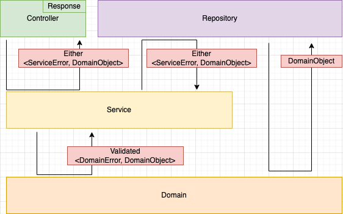

# RealWorld

## アーキテクチャ

## UseCase

- UseCase層は必ずEither<ユースケースエラー, ドメインオブジェクト>を返す
- 基本的にUseCase層はドメインオブジェクトをインスタンス化する時、バリデーションをかける

## Infra

- Infra層は必ずEither<ユースケースエラー, ドメインオブジェクト>を返す
- Infra層はドメインオブジェクトのバリデーションなしでインスタンス化可能である

## Either<E, T>とValidated<E, T>

- Eは自作エラー
- Tはドメインオブジェクト

[詳細](./docs/README.md)