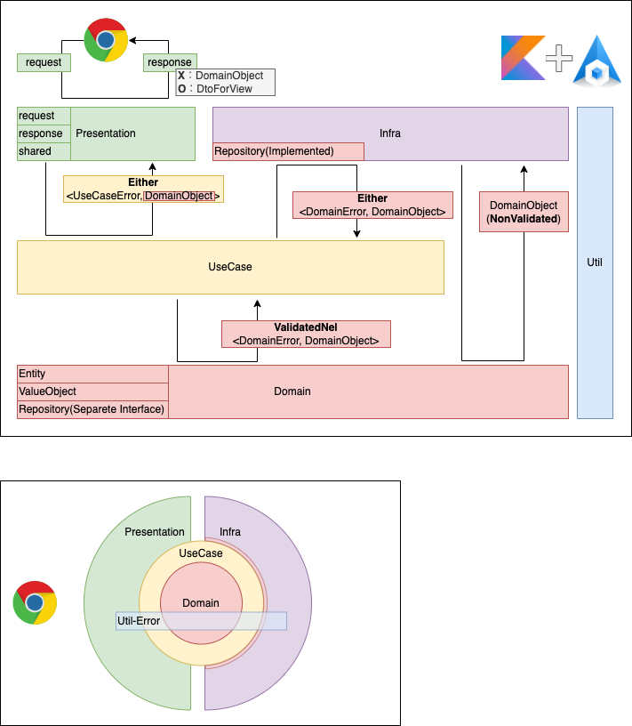

# RealWorld


[](https://codeclimate.com/github/sunakan/realworld-kotlin-springboot-jdbc/maintainability)
[](https://codeclimate.com/github/sunakan/realworld-kotlin-springboot-jdbc/test_coverage)
[](https://codecov.io/gh/sunakan/realworld-kotlin-springboot-jdbc)

## 開発

```
make
```

```
######################################################################
# Makeタスク一覧
# $ make XXX
# or
# $ make XXX --dry-run
######################################################################
up                   サーバー起動
up.db                db起動
down.db              dbを落とす
test                 テスト実行
test.with-local-db   テスト(with local db)実行
test.e2e             e2eテスト実行
fmt                  format
lint                 lint
docs.generate-db-docs-schemaspy schemaspyでDB用のドキュメントを作成、表示する(gitに含めない)
docs.generate-kdoc   KDocを生成と表示(gitに含めない)
help                 Make タスク一覧
```

## アーキテクチャ



## UseCase

- UseCase層は必ず `Either<UseCaseError, UseCaseOutput>` を返す（例外：認証時の戻り値はDomainObjectで良い）
  - Domain〇〇をそのまま返さないこと（必要であればWrapする）
    - 詰め替える
    - Wrapする時、Either自体の入れ子はやめること(取り出して中身をWrapする)
- 基本的にUseCase層でDomainObjectをインスタンス化する時、バリデーションをかける
- UseCaseError、UseCaseOutputの命名では技術的用語を使わないようにする

## Infra

- Infra層は必ずEither<DomainError, DomainObject>を返す
- Infra層はDobmainObjectのバリデーション無しでインスタンス化可能である

## Either<E, T>とValidatedNel<E, T>

|型        |自作/他作|言葉      |説明、代替表現                                                                                                                |
|:--------:|:-------:|:---------|:-----------------------------------------------------------------------------------------------------------------------------|
|T         |自作     |正常系    |- 晴れの日<br />- 基本コース                                                                                                  |
|E         |自作     |準正常系  |- 雨の日<br />- 代替コース<br />- ビジネス例外<br />- 予期する例外<br />- 回復可能なエラー<br />- データとして定義されるエラー|
|Throwable |他作     |異常系    |- 技術的例外<br />- 予期しない例外<br />- 回復不可能なエラー                                                                  |

## 他レイヤーやテスト方法等

[詳細](./docs/README.md)

## DBについて

[詳細](./docs/db/README.md)
