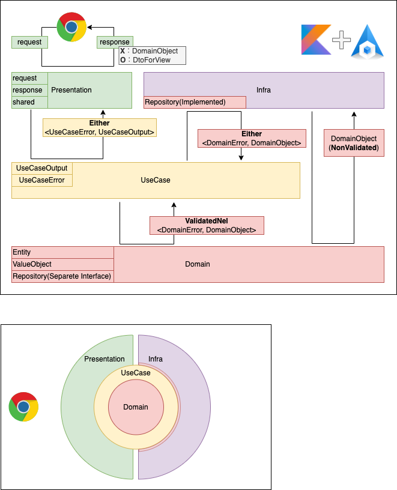

# RealWorld

## アーキテクチャ

## UseCase

- UseCase層は必ずEither<UseCaseError, DomainObject>を返す
  - DomainObjectErrorをそのまま返さないこと（必要であればWrapする）
    - Wrapする時、Either自体の入れ子はやめること(取り出して中身をWrapする)
- 基本的にUseCase層はドメインオブジェクトをインスタンス化する時、バリデーションをかける
- UseCaseエラーの命名では技術的用語を使わないようにする

## Infra

- Infra層は必ずEither<UseCaseError, DomainObject>を返す
- Infra層はドメインオブジェクトのバリデーションなしでインスタンス化可能である

## Either<E, T>とValidated<E, T>

- Eは自作エラー
- Tはドメインオブジェクト

[詳細](./docs/README.md)
